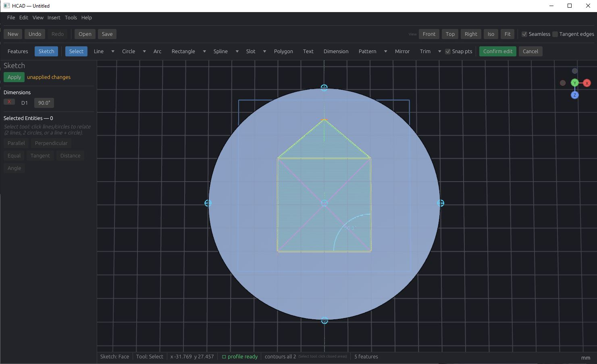
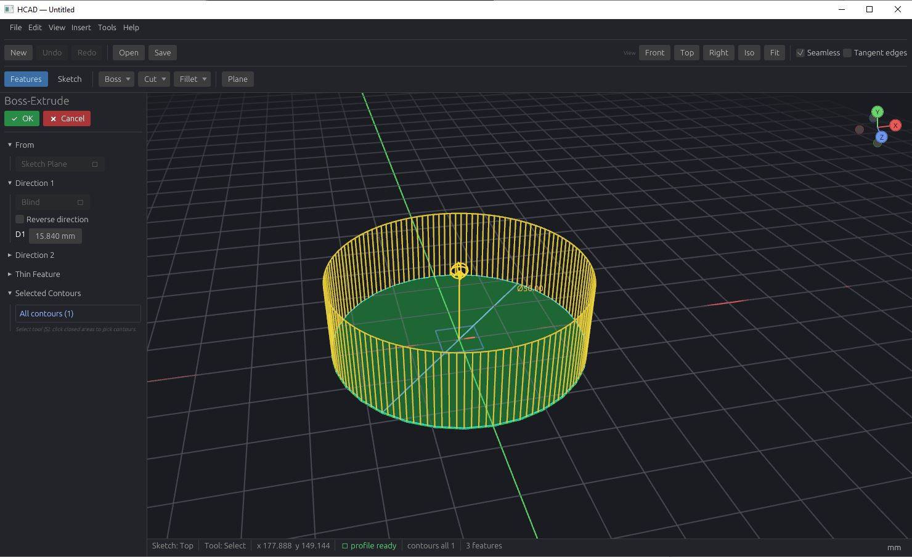
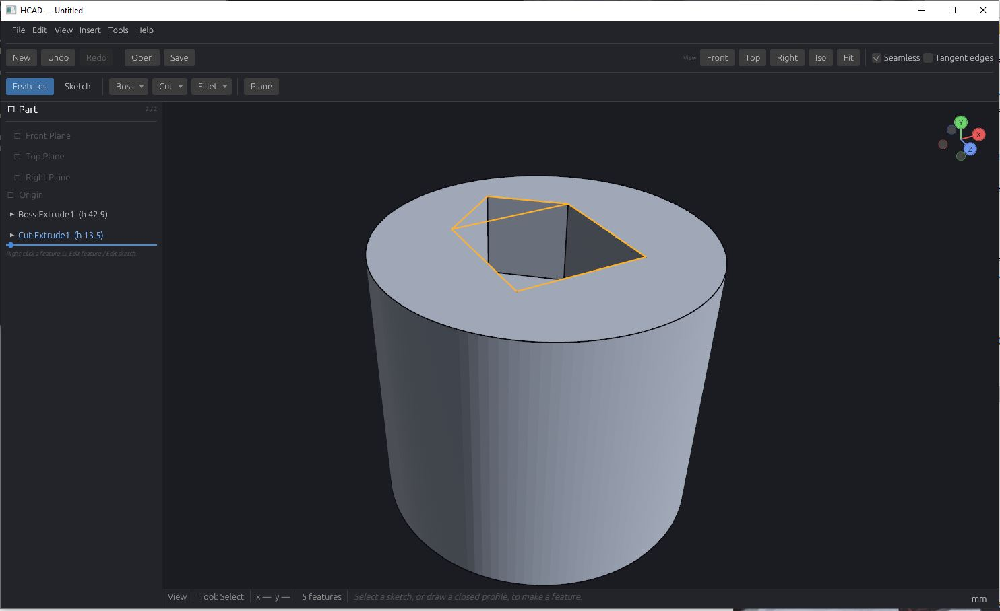
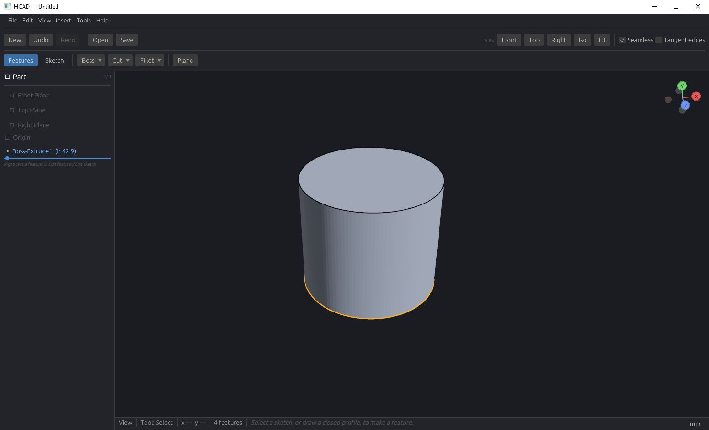

# HCAD

**A SolidWorks-style parametric CAD modeler, written in Rust.**

HCAD is an in-development desktop CAD application for **feature-based parametric solid
modeling** — the same workflow you'd recognize from SolidWorks, Fusion 360, or FreeCAD:
sketch in 2D, turn sketches into 3D solids, and edit any earlier step to have the whole
model rebuild itself.

> **Status: alpha — runnable.** The core parametric workflow is implemented and the
> app builds and runs today: reference planes → 2D sketching → constraints &
> dimensions → extrude/cut solids → an editable feature tree with rollback,
> regeneration, undo/redo, and save/load. Milestones **M0–M7 are complete**; work
> now is on the M8+ advanced features (revolve, fillet, chamfer, pattern). See the
> roadmap below and [`DESIGN.md`](DESIGN.md) for the architecture.

---

## Screenshots

| Sketching | Boss extrude |
|---|---|
|  |  |
| *Sketch mode: a profile on a face with inference, geometric relations, and driving dimensions.* | *Boss extrude: PropertyManager, draggable direction gizmo, and live preview.* |

| Cut + feature tree | Solid body |
|---|---|
|  |  |
| *Cut feature through a boss, with the editable feature tree and the selected feature's profile highlighted.* | *A finished solid — feature tree, view triad, and edge-selection highlight.* |

---

## What it does (the intended workflow)

1. **Reference planes.** Start with three datum planes (Front / Top / Right) and create
   your own offset or angled planes.
2. **2D sketching.** Open a plane and draw with basic tools — lines, **construction
   lines (with midpoints)**, circles, rectangles/squares, arcs, and points.
3. **Constraints & dimensions.** Apply geometric relations (coincident, horizontal,
   vertical, parallel, perpendicular, equal, midpoint, tangent, concentric) and driving
   dimensions. A constraint solver positions the geometry to satisfy all of them at once,
   so the sketch is *parametric*, not just drawn.
4. **Features (2D → 3D).** Turn closed sketch profiles into solids:
   - **Extrude** (boss / add material)
   - **Cut** (subtractive extrude / remove material)
   - *(planned: Revolve, Fillet, Chamfer, linear/circular Pattern)*
5. **Sketch on 3D faces.** Select a planar face of an existing solid and start a new
   sketch on it, then extrude or cut again.
6. **Editable history.** Every step lives in a **feature tree**. Roll back to any earlier
   feature, change a dimension or sketch, and the model **regenerates** downstream — this
   parametric history is the core of the application.

---

## Architecture (short version)

HCAD is built in four decoupled layers. The full write-up — including the
feature-tree/regeneration model and the topological-naming strategy — is in
[`DESIGN.md`](DESIGN.md).

| Layer | Responsibility | Built on |
|-------|----------------|----------|
| Geometry kernel | B-rep solids, extrude (sweep), boolean cut, tessellation | [`truck`](https://github.com/ricosjp/truck) (exact B-rep, pure Rust) + [`Manifold`](https://github.com/elalish/manifold) (robust mesh booleans, C++) as a fallback for coincident-face cases |
| Sketcher + solver | 2D entities, constraints, Newton/least-squares solve | our code (nalgebra) |
| Document / feature tree | parametric-history DAG, regeneration — **the source of truth** | our code |
| Viewport / UI | 3D rendering, camera, face/edge picking, gizmos, panels | [`Bevy`](https://bevyengine.org/) + `bevy_egui` |

The kernel, sketcher, and document crates are **Bevy-free and testable headless**; the
Bevy app is a thin presentation shell on top.

### Planned workspace layout
```
hworks-geometry/   # kernel trait + truck impl, tessellation
hworks-sketch/     # sketch entities + constraint solver
hworks-document/   # feature tree, regeneration, save/load
hworks-app/        # Bevy viewport + egui UI
```

---

## Roadmap

Each milestone is independently runnable.

| Milestone | Deliverable | Status |
|-----------|-------------|:------:|
| **M0** | Bevy window, orbit camera, render the three reference planes | ✅ |
| **M1** | Pick a plane → flat (unconstrained) sketch mode | ✅ |
| **M2** | Constraint solver v1, rectangle tool, construction lines, drag-to-resolve | ✅ |
| **M3** | First solid — extrude a sketch profile | ✅ |
| **M4** | Extrude-cut (boolean) + feature-tree panel | ✅ |
| **M5** | Sketch on a solid face (stable topological IDs introduced) | ✅ |
| **M6** | Edit an earlier feature → regenerate downstream; rollback bar | ✅ |
| **M7** | Save / load documents (RON `.hcad` files) | ✅ |
| **M8+** | Revolve, Fillet, Chamfer, Pattern, concentric constraint, dimension display polish | 🔲 |

Implemented today:

- **Sketch tools:** Select/drag, Line, Circle, Rectangle, Dimension, construction
  geometry, and midpoint / circle-centre / quadrant snap (inference) points.
- **Constraints:** coincident, horizontal, vertical, midpoint, distance (driving
  dimension), parallel, perpendicular, equal, tangent — solved together so the
  sketch is parametric. *(Concentric is still on the M8+ list.)*
- **Features:** extrude boss (union), extrude cut (boolean), an editable feature
  tree with per-feature depth editing, a rollback bar, downstream regeneration,
  64-level undo/redo, and save/load.

---

## Building & running

### Build prerequisites

HCAD's geometry kernel uses [`Manifold`](https://github.com/elalish/manifold) (a C++
library) for robust mesh booleans, so building from source needs a **C++ toolchain and
CMake** in addition to Rust:

- **Rust** (stable, MSVC toolchain on Windows).
- **CMake** on `PATH` — e.g. `winget install Kitware.CMake`, then ensure
  `C:\Program Files\CMake\bin` is on `PATH` (a fresh terminal picks it up). If a build
  fails with *"cmake not found"*, this is why.
- **A C++ compiler** — on Windows, the MSVC toolchain from Visual Studio (or the
  standalone *Build Tools for Visual Studio*, "Desktop development with C++" workload).
  Manifold is compiled once and **statically linked** into the `hcad` binary.

> These are **build-time only**. The shipped `hcad.exe` is self-contained — end users
> who run an installer need none of this.

```sh
cargo run -p hworks-app          # runs the `hcad` binary (debug)
cargo build --release            # optimized build → target/release/hcad
```

The application crate is `hworks-app`; the binary it produces is named **`hcad`**.
The kernel, sketcher, and document crates build and test headless:

```sh
cargo test                       # headless tests (geometry, sketch, document)
```

Prebuilt Windows binaries are on the **Releases** page.

### Packaging / installer note

Because Manifold is C++, the built `hcad.exe` depends on the **Visual C++
Redistributable** (`MSVCP140.dll`, `VCRUNTIME140.dll`). An installer must ensure it's
present, two standard ways:

1. **Bundle the redistributable** — ship Microsoft's `vc_redist.x64.exe` and run it
   silently during install (idempotent; most machines already have it).
2. **Statically link the C++ runtime** — build both Rust (`-C target-feature=+crt-static`)
   and Manifold (`/MT`) against the static CRT, producing a fully self-contained exe with
   no external runtime DLLs. Preferred when the flags line up cleanly.

The Universal CRT (`api-ms-win-crt-*`) ships with Windows 10/11, so no action is needed
for it.

### Flickering on a laptop with hybrid graphics

Many laptops have two GPUs — an integrated one (Intel/AMD) wired to the display, and a
discrete one (NVIDIA/AMD) for performance. By default HCAD renders on the **discrete**
GPU, which is stable. On some hybrid laptops this causes flickering, because each frame
is copied from the discrete GPU to the integrated one for display.

The flicker-free fix is to render on the **integrated** GPU (it's connected straight to
the screen). Set the `HCAD_GPU` environment variable:

```sh
HCAD_GPU=integrated   # render on the integrated GPU (no cross-GPU flicker)
HCAD_GPU=discrete     # render on the discrete GPU (default)
```

> ⚠️ If the integrated GPU crashes with a *"device lost / suspended"* error, its driver
> is likely out of date — update the integrated GPU's driver (AMD Adrenalin / Intel
> Graphics) and try again. A CAD viewport runs fine on integrated graphics.

---

## License

TBD.
